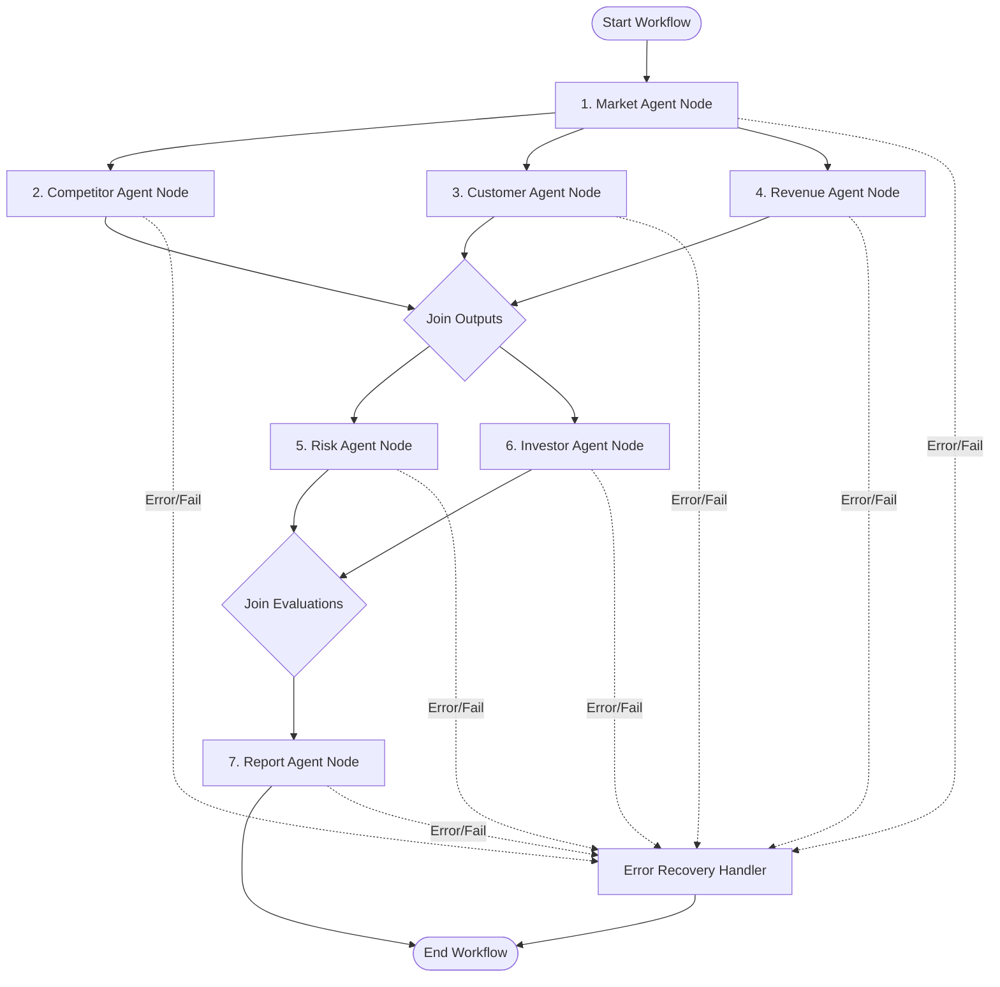

# AI Startup Validator: LangGraph Workflow Design Specification

This document details the state-graph architecture, execution logic, error handling, and parallel execution paths for the multi-agent system built using **LangGraph**.

---

## 1. Graph Diagram

To optimize execution speed, agents run in parallel branches where dependency configurations allow.



---

## 2. State Schema (`AgentState`)

The state class contains input constraints, structural agent outputs, metadata tracking, and error-handling dictionary structures.

```python
from typing import Any, Dict, List, TypedDict, Optional

class AgentState(TypedDict):
    # --- Input parameters ---
    idea: str
    target_market: str
    budget: float
    customer_segment: str
    
    # --- Agent Outputs ---
    market_data: Optional[Dict[str, Any]]
    competitor_data: Optional[Dict[str, Any]]
    customer_data: Optional[Dict[str, Any]]
    revenue_data: Optional[Dict[str, Any]]
    risk_data: Optional[Dict[str, Any]]
    investor_data: Optional[Dict[str, Any]]
    report_data: Optional[Dict[str, Any]]
    
    # --- Workflow Control & Meta ---
    current_node: str
    errors: Dict[str, str]       # Node name -> Error message map
    retry_count: Dict[str, int]   # Node name -> retry count
    status: str                  # pending | processing | completed | failed
```

---

## 3. Node Definitions

Each node in the LangGraph corresponds to a dedicated agent wrapper designed to query the LLM (GPT-4o or Claude 3.5 Sonnet) using structured output parsing.

### 1. Market Agent Node
*   **Purpose:** Estimates Target Addressable Market (TAM), SAM, SOM, CAGR, and identifies industry headwinds/tailwind dynamics.
*   **Pre-requisites:** Input fields (`idea`, `target_market`).
*   **Behavior:** Calls the LLM to research the industry category. Returns structured market projections.

### 2. Competitor Agent Node
*   **Purpose:** Identifies direct and indirect competitors, analyzes competitor strengths/weaknesses, and measures barrier entry points.
*   **Pre-requisites:** Input fields + `market_data`.
*   **Behavior:** Uses market classifications to locate top market players.

### 3. Customer Agent Node
*   **Purpose:** Designs demographic profiles, lists psychographic pain points, map user behaviors, and defines user acquisition funnels.
*   **Pre-requisites:** Input fields + `market_data`.
*   **Behavior:** Creates detailed Ideal Customer Profile (ICP) personas.

### 4. Revenue Agent Node
*   **Purpose:** Estimates a 3-year financial growth track, details customer acquisition cost (CAC) caps, and maps pricing structures.
*   **Pre-requisites:** Input fields (`budget`) + `market_data`.
*   **Behavior:** Generates financial projections based on starting capital bounds.

### 5. Risk Agent Node
*   **Purpose:** Scores operational, regulatory, and market risks. Proposes mitigation roadmaps.
*   **Pre-requisites:** `competitor_data` + `customer_data` + `market_data`.
*   **Behavior:** Audits the structural plans to identify critical vulnerabilities.

### 6. Investor Agent Node
*   **Purpose:** Evaluates pitch parameters, reviews capital efficiency, scores scalability, and delivers investment verdicts.
*   **Pre-requisites:** `market_data` + `competitor_data` + `revenue_data`.
*   **Behavior:** Simulates a Venture Capital investment committee review.

### 7. Report Agent Node
*   **Purpose:** Synthesizes analysis data, creates charts, compiles markdown, generates PDFs, and updates DB records.
*   **Pre-requisites:** All previous outputs.
*   **Behavior:** Combines evaluations into a unified project payload, writes PDF to Supabase Storage, and sets status to `completed`.

---

## 4. Execution Data Flow

```text
[Input] -> (Market Agent) 
              │
              ├──> (Competitor Agent) ──> [Merge Node] ──> (Risk Agent) ─────┐
              │                                                              ├──> (Report Agent) -> [Output]
              ├──> (Customer Agent)   ──> [Merge Node] ──> (Investor Agent) ─┘
              │
              └──> (Revenue Agent)    ──> [Merge Node]
```

---

## 5. Retry Handling & Error Recovery Design

To ensure production-grade resilience, the system handles rate limits, context window overages, and formatting errors via three layers:

### A. Automatic Node Retries (Decorators)
All agents execute using the Python `tenacity` library to recover from transient exceptions (e.g. HTTP 429 Rate Limits, HTTP 503 Server Errors).

```python
from tenacity import retry, stop_after_attempt, wait_exponential, retry_if_exception_type

@retry(
    stop=stop_after_attempt(3),
    wait=wait_exponential(multiplier=1, min=2, max=10),
    retry=retry_if_exception_type((ConnectionError, TimeoutError, APIError)),
    reraise=True
)
def invoke_llm_agent(node_name: str, state: AgentState):
    # LLM execution logic here
```

### B. Node-Level Error Catching (LangGraph Fallback Routing)
If all 3 tenacity retries fail, the node catches the error and writes it to the state metadata.

1.  **Try/Catch Node Wrapper:**
    ```python
    def safe_node_execute(state: AgentState, agent_callable):
        node_name = agent_callable.__name__
        try:
            # Execute actual agent code
            return agent_callable(state)
        except Exception as e:
            # Capture error details in state instead of crashing
            updated_errors = state.get("errors", {})
            updated_errors[node_name] = str(e)
            
            # Produce mock/degraded safe data so downstream agents don't crash
            fallback_data = generate_degraded_fallback(node_name, state)
            
            return {
                f"{node_name}_data": fallback_data,
                "errors": updated_errors
            }
    ```

2.  **Degraded Mode Fallbacks:**
    Instead of failing the entire validation process if one agent fails (e.g., the *Revenue Agent* fails to load due to token issues), the fallback generator outputs a default structured dictionary containing a warning message (e.g., `"financial_forecast_unavailable": true`), allowing the rest of the report to compile successfully.

### C. Final Error Recovery Node
If a critical component fails (such as the *Report Agent* failing to compile the final document), the graph routes to the `FailNode`:
1.  Sets project status to `failed` in the database.
2.  Writes the log messages from `state["errors"]` to the `agent_logs` table to give the user context.
3.  Sends a socket error notification to the frontend.
