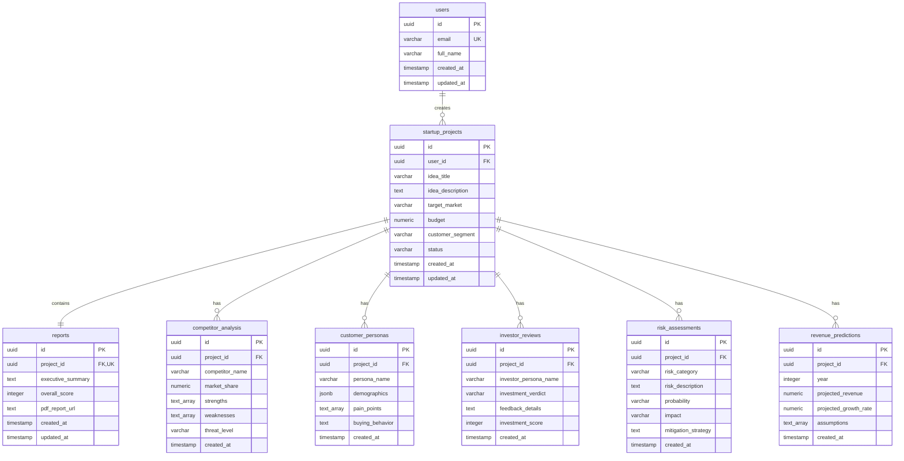

# AI Startup Validator: Database Schema & Design Specification

This document details a production-ready PostgreSQL database design for the AI Startup Validator platform, optimized for performance, security, and native integration with **Supabase**.

---

## 1. Entity Relationship (ER) Diagram



---

## 2. PostgreSQL DDL SQL Schema

Refer to the database initialization script at [20260619000000_init_schema.sql](./supabase/migrations/20260619000000_init_schema.sql) for the exact SQL statement.

---

## 3. Database Performance Indexes

Indexes speed up execution on foreign-key lookup patterns, pagination, sorting, and JSON searches.

```sql
-- Indexes for projects search and sorting
CREATE INDEX idx_startup_projects_user_id ON public.startup_projects(user_id);
CREATE INDEX idx_startup_projects_status ON public.startup_projects(status);
CREATE INDEX idx_startup_projects_created_at ON public.startup_projects(created_at DESC);

-- Unique/FK Index for report lookup
CREATE INDEX idx_reports_project_id ON public.reports(project_id);

-- Indexes for sub-agent data lookups
CREATE INDEX idx_competitor_analysis_project_id ON public.competitor_analysis(project_id);
CREATE INDEX idx_customer_personas_project_id ON public.customer_personas(project_id);
CREATE INDEX idx_investor_reviews_project_id ON public.investor_reviews(project_id);
CREATE INDEX idx_risk_assessments_project_id ON public.risk_assessments(project_id);
CREATE INDEX idx_revenue_predictions_project_id ON public.revenue_predictions(project_id);

-- GIN (Generalized Inverted Index) on demographics JSONB for unstructured fields querying
CREATE INDEX idx_customer_personas_demographics ON public.customer_personas USING gin (demographics);
```

---

## 4. Supabase Integration & Automation Triggers

### A. Sync Profile Trigger
An automated trigger that copies user details from Supabase Auth (`auth.users`) into the public database schema (`public.users`) immediately upon sign-up.

```sql
CREATE OR REPLACE FUNCTION public.handle_new_user()
RETURNS TRIGGER AS $$
BEGIN
    INSERT INTO public.users (id, email, full_name)
    VALUES (
        new.id,
        new.email,
        COALESCE(new.raw_user_meta_data->>'full_name', '')
    );
    RETURN NEW;
END;
$$ LANGUAGE plpgsql SECURITY DEFINER;

CREATE OR REPLACE TRIGGER on_auth_user_created
    AFTER INSERT ON auth.users
    FOR EACH ROW EXECUTE FUNCTION public.handle_new_user();
```

### B. Auto-update timestamps
Ensures `updated_at` gets modified on row changes.

```sql
CREATE OR REPLACE FUNCTION public.set_current_timestamp_updated_at()
RETURNS TRIGGER AS $$
BEGIN
    new.updated_at = timezone('utc'::text, now());
    RETURN new;
END;
$$ LANGUAGE plpgsql;

CREATE TRIGGER set_users_updated_at BEFORE UPDATE ON public.users FOR EACH ROW EXECUTE FUNCTION public.set_current_timestamp_updated_at();
CREATE TRIGGER set_projects_updated_at BEFORE UPDATE ON public.startup_projects FOR EACH ROW EXECUTE FUNCTION public.set_current_timestamp_updated_at();
CREATE TRIGGER set_reports_updated_at BEFORE UPDATE ON public.reports FOR EACH ROW EXECUTE FUNCTION public.set_current_timestamp_updated_at();
```

### C. Row Level Security (RLS) Policies
Secures client data by preventing one user from querying another's ideas, metrics, or generated evaluations.

```sql
ALTER TABLE public.users ENABLE ROW LEVEL SECURITY;
ALTER TABLE public.startup_projects ENABLE ROW LEVEL SECURITY;
ALTER TABLE public.reports ENABLE ROW LEVEL SECURITY;
ALTER TABLE public.competitor_analysis ENABLE ROW LEVEL SECURITY;
ALTER TABLE public.customer_personas ENABLE ROW LEVEL SECURITY;
ALTER TABLE public.investor_reviews ENABLE ROW LEVEL SECURITY;
ALTER TABLE public.risk_assessments ENABLE ROW LEVEL SECURITY;
ALTER TABLE public.revenue_predictions ENABLE ROW LEVEL SECURITY;
```

*Refer to the full SQL file for details on individual policies.*

### D. Supabase Storage Design
A private storage bucket called `validation-reports` must be created within Supabase Storage. The access rules are restricted via policies:

*   **Bucket Name:** `validation-reports`
*   **Access Type:** Authenticated & Private (requires signature url to view)
*   **Policy Name:** `Allow users to view own project reports`
*   **SQL Access Logic:**
    ```sql
    CREATE POLICY "Allow owners access to their PDF reports" ON storage.objects
        FOR SELECT TO authenticated
        USING (
            bucket_id = 'validation-reports' AND
            (storage.foldername(name))[1] IN (
                SELECT id::text FROM public.startup_projects WHERE user_id = auth.uid()
            )
        );
    ```
