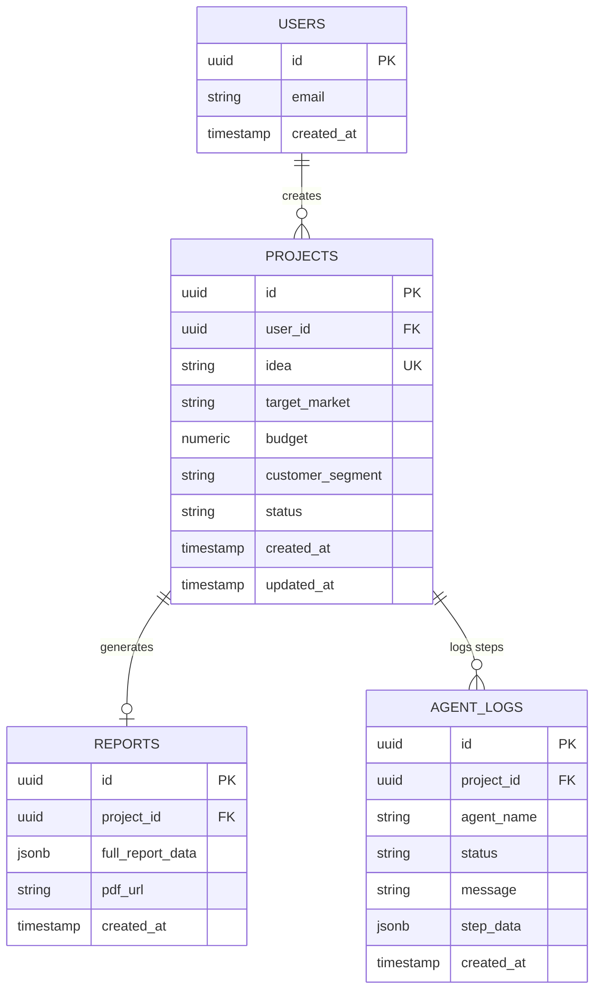
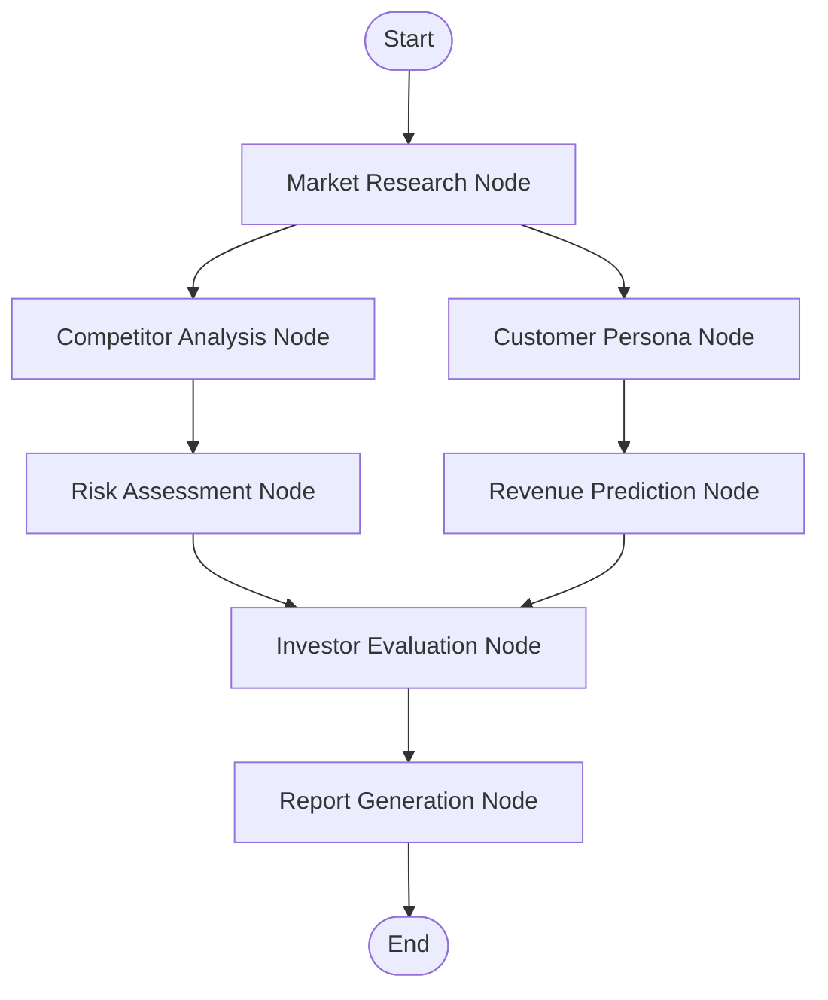
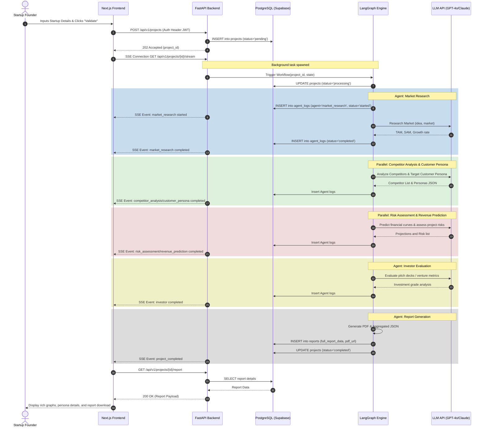

# AI Startup Validator: Architecture & Design Specification

This document details the system architecture, folder structure, database schema, API design, and multi-agent workflow for the **AI Startup Validator** platform.

---

## 1. System Architecture

The platform utilizes a modern, decoupled architecture designed for high scalability, real-time feedback, and decoupled execution of long-running LLM agent tasks.

```mermaid
graph TD
    User([User / Browser]) <--> |HTTP / WebSockets / SSE| Frontend[Next.js Frontend]
    Frontend <--> |Auth / JWT| SupabaseAuth[Supabase Auth]
    Frontend <--> |REST API / SSE| Backend[FastAPI Backend]
    
    Backend <--> |SQLModel / Asyncpg| SupabaseDB[(Supabase PostgreSQL)]
    Backend --> |Trigger LangGraph Workflow| LangGraph[LangGraph Engine]
    
    subgraph Agent Cluster (LangGraph)
        LangGraph --> MR[Market Research Agent]
        LangGraph --> CA[Competitor Analysis Agent]
        LangGraph --> CP[Customer Persona Agent]
        LangGraph --> IA[Investor Agent]
        LangGraph --> RA[Risk Assessment Agent]
        LangGraph --> RP[Revenue Prediction Agent]
        LangGraph --> RG[Report Generation Agent]
    end
    
    LangGraph <--> |State DB Checkpointing| SupabaseDB
    MR & CA & CP & IA & RA & RP & RG <--> |LLM Queries| LLM[LLM API: GPT-4o / Claude 3.5]
    RG --> |Upload PDF / Reports| SupabaseStorage[Supabase Storage]
```

### Component Details
*   **Frontend (Next.js):** A responsive, TypeScript-based dashboard utilizing TailwindCSS and shadcn/ui. Connects directly to Supabase for authentication and file retrieval, and to the FastAPI backend for starting validations and receiving real-time agent updates.
*   **Backend (FastAPI):** An asynchronous Python API that manages user inputs, project metadata, API routing, and triggers the LangGraph background tasks. Provides Server-Sent Events (SSE) to stream agent progress back to the user.
*   **Database (Supabase / PostgreSQL):** Stores user data, project briefs, agent logs, checkpoint states, and finalized report summaries.
*   **Agent Workflow (LangGraph):** Orchestrates the multi-agent graph, enabling structured states, memory checkpointing, parallel execution, and step-by-step logging.
*   **Storage (Supabase Storage):** Stores the generated PDF validation reports.

---

## 2. Folder Structure

A monorepo structure is recommended for this project to maintain tight integration between backend models and frontend typing.

```text
ai-startup-validator/
├── .gitignore
├── README.md
├── supabase/
│   ├── config.toml
│   ├── migrations/
│   │   └── 20260619000000_init_schema.sql
│   └── seed.sql
├── frontend/                     # Next.js Application
│   ├── package.json
│   ├── tsconfig.json
│   ├── tailwind.config.js
│   ├── public/
│   └── src/
│       ├── app/                  # App Router
│       │   ├── layout.tsx
│       │   ├── page.tsx          # Landing / Auth
│       │   ├── dashboard/        # Dashboard (Projects List)
│       │   └── projects/
│       │       ├── new/          # Submission Form
│       │       └── [id]/         # Realtime Report / Agent Status
│       ├── components/
│       │   ├── ui/               # shadcn components
│       │   ├── agent-progress.tsx
│       │   ├── competitor-chart.tsx
│       │   └── report-viewer.tsx
│       ├── lib/
│       │   ├── supabase.ts       # Supabase Client JS
│       │   └── api.ts            # Backend API Fetcher
│       └── types/
│           └── index.ts          # Unified TypeScript interfaces
└── backend/                      # FastAPI Application
    ├── README.md
    ├── requirements.txt
    ├── Dockerfile
    ├── main.py                   # App entrypoint
    ├── app/
    │   ├── __init__.py
    │   ├── config.py             # Settings (Pydantic base settings)
    │   ├── database.py           # DB connection & session creation
    │   ├── models/               # SQLModel schemas
    │   │   ├── project.py
    │   │   ├── report.py
    │   │   └── log.py
    │   ├── api/                  # Routers
    │   │   ├── auth.py           # Supabase JWT dependency validation
    │   │   ├── projects.py       # Submission & fetching
    │   │   └── reports.py        # Finalized JSON & PDF retrieval
    │   └── agents/               # LangGraph multi-agent system
    │       ├── __init__.py
    │       ├── graph.py          # StateGraph construction & compilation
    │       ├── state.py          # TypedDict for LangGraph state
    │       └── nodes/            # Individual agent logic & LLM prompts
    │           ├── market_research.py
    │           ├── competitor_analysis.py
    │           ├── customer_persona.py
    │           ├── investor_agent.py
    │           ├── risk_assessment.py
    │           ├── revenue_prediction.py
    │           └── report_generation.py
```

---

## 3. Database Schema

PostgreSQL schema containing relationships, foreign keys, and indexes for performant queries.



### Table DDL Statements

```sql
-- 1. Projects Table
CREATE TYPE project_status AS ENUM ('pending', 'processing', 'completed', 'failed');

CREATE TABLE projects (
    id UUID PRIMARY KEY DEFAULT gen_random_uuid(),
    user_id UUID NOT NULL REFERENCES auth.users(id) ON DELETE CASCADE,
    idea TEXT NOT NULL,
    target_market VARCHAR(255) NOT NULL,
    budget NUMERIC(12, 2) NOT NULL,
    customer_segment VARCHAR(255) NOT NULL,
    status project_status NOT NULL DEFAULT 'pending',
    created_at TIMESTAMP WITH TIME ZONE DEFAULT TIMEZONE('utc'::text, NOW()) NOT NULL,
    updated_at TIMESTAMP WITH TIME ZONE DEFAULT TIMEZONE('utc'::text, NOW()) NOT NULL
);

CREATE INDEX idx_projects_user_id ON projects(user_id);

-- 2. Reports Table
CREATE TABLE reports (
    id UUID PRIMARY KEY DEFAULT gen_random_uuid(),
    project_id UUID NOT NULL UNIQUE REFERENCES projects(id) ON DELETE CASCADE,
    full_report_data JSONB NOT NULL,
    pdf_url TEXT,
    created_at TIMESTAMP WITH TIME ZONE DEFAULT TIMEZONE('utc'::text, NOW()) NOT NULL
);

-- 3. Agent Logs Table (for real-time streaming to UI)
CREATE TYPE agent_status AS ENUM ('started', 'running', 'completed', 'failed');

CREATE TABLE agent_logs (
    id UUID PRIMARY KEY DEFAULT gen_random_uuid(),
    project_id UUID NOT NULL REFERENCES projects(id) ON DELETE CASCADE,
    agent_name VARCHAR(100) NOT NULL,
    status agent_status NOT NULL,
    message TEXT,
    step_data JSONB,
    created_at TIMESTAMP WITH TIME ZONE DEFAULT TIMEZONE('utc'::text, NOW()) NOT NULL
);

CREATE INDEX idx_agent_logs_project_id ON agent_logs(project_id);
```

---

## 4. API Design

### Authentication
FastAPI authenticates requests using the `Authorization: Bearer <Supabase_JWT>` header, validating the JWT against Supabase's public keys.

### Endpoints

#### 1. Projects Router
*   `POST /api/v1/projects`
    *   **Description:** Submits a new startup idea for validation. Triggers LangGraph asynchronously.
    *   **Request Body:**
        ```json
        {
          "idea": "An AI-powered automated code reviewer for pull requests.",
          "target_market": "Global software organizations",
          "budget": 50000.00,
          "customer_segment": "Engineering leaders and developers"
        }
        ```
    *   **Response (202 Accepted):**
        ```json
        {
          "id": "e4b3c7d6-3e4b-4f9a-9e12-32a512345678",
          "status": "pending",
          "created_at": "2026-06-19T13:38:38Z"
        }
        ```

*   `GET /api/v1/projects`
    *   **Description:** Lists all project briefs submitted by the authenticated user.
    *   **Response (200 OK):**
        ```json
        [
          {
            "id": "e4b3c7d6-3e4b-4f9a-9e12-32a512345678",
            "idea": "An AI-powered automated code reviewer...",
            "status": "processing",
            "created_at": "2026-06-19T13:38:38Z"
          }
        ]
        ```

*   `GET /api/v1/projects/{id}/stream`
    *   **Description:** Server-Sent Events (SSE) endpoint to stream real-time updates from individual agents as they execute in the background.
    *   **Event Types:** `agent_started`, `agent_completed`, `project_failed`, `project_completed`.

#### 2. Reports Router
*   `GET /api/v1/projects/{id}/report`
    *   **Description:** Fetches the finalized validation report (both structural data and the reference PDF).
    *   **Response (200 OK):**
        ```json
        {
          "project_id": "e4b3c7d6-3e4b-4f9a-9e12-32a512345678",
          "pdf_url": "https://supabase-storage.url/reports/e4b3c7d6.pdf",
          "full_report_data": {
            "summary": "High viable idea targeting a mature market. Moderate competitor saturation.",
            "market_research": { "market_size_billions": 12.5, "growth_rate": "15%" },
            "competitors": [ { "name": "SonarQube", "threat_level": "High" } ],
            "personas": [ { "role": "VP of Engineering", "pain_points": ["Review latency"] } ],
            "investor_feedback": "Attractive business model but high churn risk if integration is poor.",
            "risk_score": 62,
            "revenue_prediction": { "year_1": 150000, "year_3": 1200000 }
          }
        }
        ```

---

## 5. Agent Workflow (LangGraph)

The graph specifies how data flows sequentially and in parallel through the various sub-agents.

### State Schema (`AgentState`)
```python
from typing import Any, Dict, List, TypedDict

class AgentState(TypedDict):
    # Inputs
    idea: str
    target_market: str
    budget: float
    customer_segment: str
    
    # Intermediate outputs
    market_research: Dict[str, Any]
    competitor_analysis: Dict[str, Any]
    customer_personas: List[Dict[str, Any]]
    investor_feedback: Dict[str, Any]
    risk_assessment: Dict[str, Any]
    revenue_prediction: Dict[str, Any]
    
    # Final output
    final_report: Dict[str, Any]
    pdf_path: str
    
    # Metadata tracking
    completed_nodes: List[str]
```

### Graph Layout

1.  **Market Research Node:** Analyzes the target market sizing, CAGR, and growth drivers.
2.  **Competitor Analysis & Customer Persona Nodes (Parallel):**
    *   *Competitor Analysis:* Identifies top direct and indirect competitors.
    *   *Customer Persona:* Generates ICPs (Ideal Customer Personas) and qualitative pain points.
3.  **Risk Assessment & Revenue Prediction Nodes (Parallel):**
    *   *Risk Assessment:* Highlights market risks, execution risks, and technical blockages.
    *   *Revenue Prediction:* Estimates realistic projections based on budget constraints and TAM.
4.  **Investor Node:** Aggregates research, competitor, persona, risk, and revenue structures to perform a venture readiness evaluation.
5.  **Report Generation Node:** Assembles all preceding agent outputs into a standardized schema, generates markdown summary, creates visual graphs using a reporting utility, exports a PDF, and saves the final result to the DB.



---

## 6. Sequence Diagram

This sequence diagram displays the lifecycle of a validation request, tracing it from the frontend to the background agent network.



---

## 7. Premium UI/UX Recommendations

To satisfy high-quality aesthetic guidelines:
1.  **Dynamic Landing Page:** An dark-themed interface built using Tailwind and Outfit font, emphasizing a glassmorphism (frosted glass) main panel where user input is provided.
2.  **Live Workspace Node Graph:** As agents work, render a interactive graph showing which nodes are currently running using flashing pulse animations (`animate-pulse`).
3.  **Visual Analytics:** Use Tremor or Recharts to visualize the competitor matrices, potential revenue curves, and risk scores. Avoid default browser elements.
4.  **Instant PDF Export:** Offer a stylized PDF download leveraging modern fonts, layout hierarchies, and brand accent colors.
